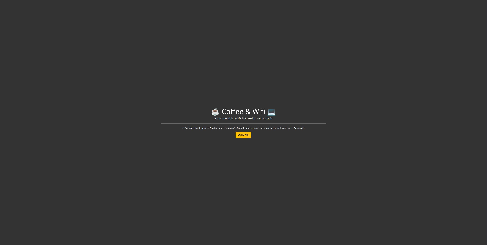
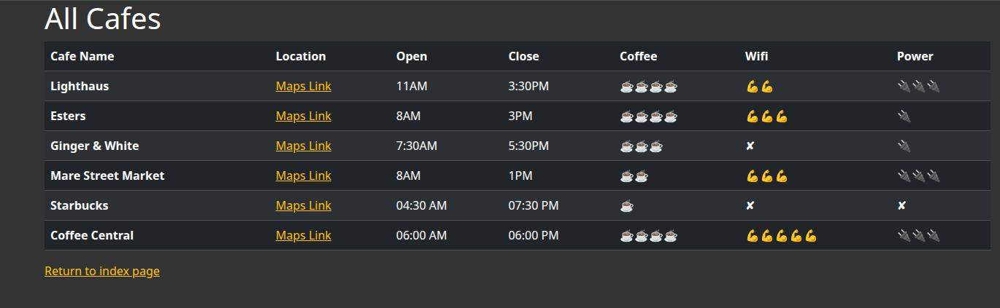

This was a simple web-app I made as a challenge for ***Angela Yu's 100 Days of Code***

# Skills Used
- Flask for the backend
- WTForms for dynamic form management
- Flask-Bootstrap for dynamic styling
- CSV parsing
- Time formatting

## Home Page:

## Data Preview:
